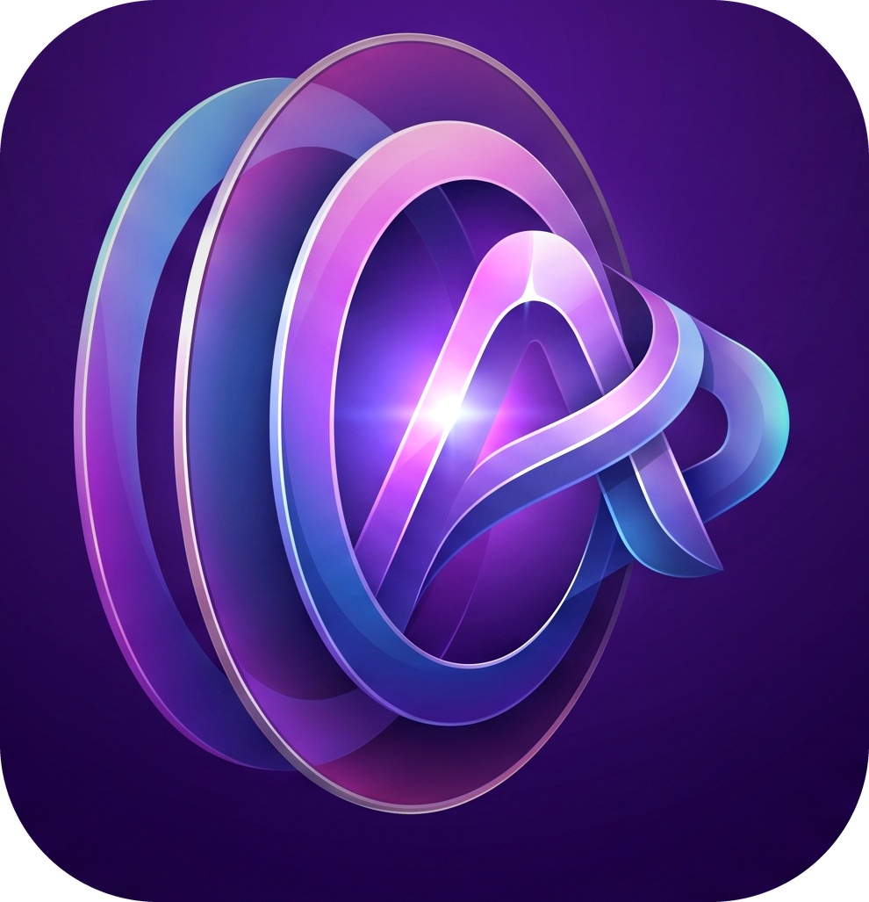
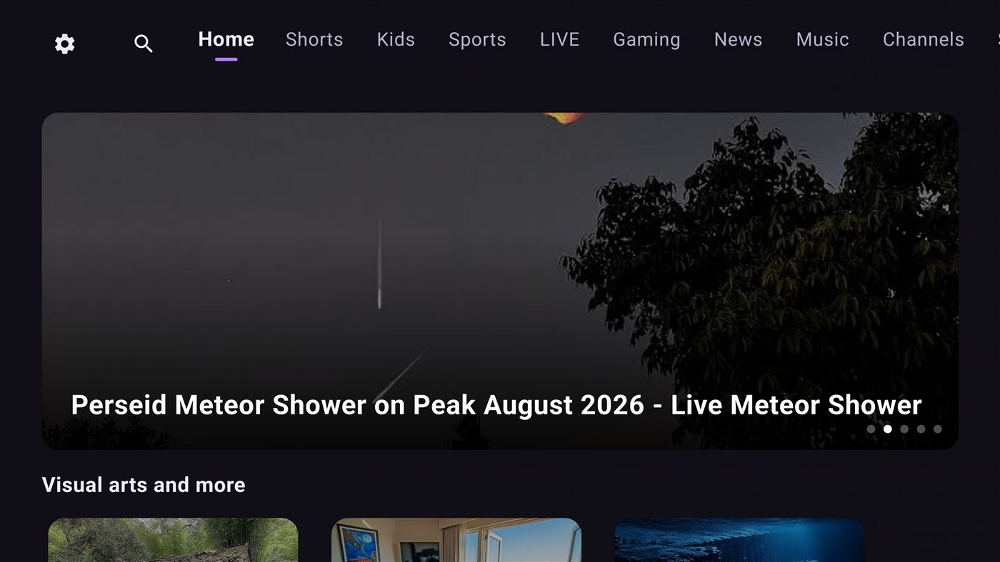
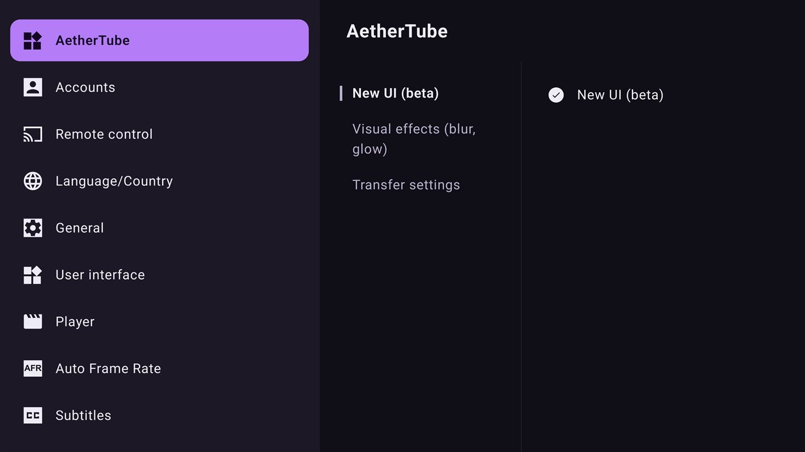
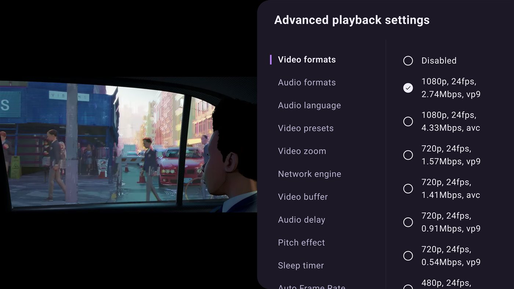

<div align="center">


# AetherTube

**[SmartTube](https://github.com/yuliskov/SmartTube), rebuilt with Jetpack Compose for TV.**

[](https://github.com/abhimanbhau/AetherTube/releases)
[](https://github.com/abhimanbhau/AetherTube/actions/workflows/CI.yml)
[](LICENSE)
[](#installation)

[Install](#installation) &nbsp;·&nbsp; [What's different](#whats-different-from-smarttube) &nbsp;·&nbsp; [Screenshots](#screenshots) &nbsp;·&nbsp; [Build from source](#build)

</div>

<br>

AetherTube is a personal fork of SmartTube — an unofficial, ad-free YouTube client for Android
TV. This fork replaces SmartTube's leanback (View-based) interface with a new UI built in Jetpack
Compose for TV. It is a hobby project, not an attempt to compete with or replace SmartTube:
everything that isn't the UI layer — YouTube API access, playback, the settings model, device
compatibility — is SmartTube's work, tracked from upstream and left alone wherever possible. See
[NOTICE.md](NOTICE.md) for the attribution this project runs on.

> [!IMPORTANT]
> **Status: personal / experimental.** Built for one setup (an Android TV box, `armeabi-v7a`),
> not tested broadly, no promises about other devices. The Compose UI is on by default — it's the
> whole point of this fork — but it's one toggle away from SmartTube's original leanback interface
> (Settings → AetherTube → **New UI (beta)**) if you'd rather fall back.

> [!WARNING]
> **Most of this code was written or substantially modified with AI assistance** (an LLM
> agent, working under the maintainer's direction), not hand-written line by line. It's been
> tested on one device, not audited, and comes with **no warranty of any kind** — see
> [LICENSE](LICENSE). Use it, fork it, read the code before you trust it with your setup, and
> don't expect timely support: this is a personal project, not a maintained product.

<br>

## What's different from SmartTube

**🔑 Move your whole setup in 12 characters.** Every setting you've tuned — video quality,
playback behavior, SponsorBlock, interface tweaks — collapses into a short code like
`3G41-96RJ-ARGN`. Setting up a new TV, or wiped and reinstalled? Type the code in and you're
back exactly where you left off. No account, no cloud, nothing to breach — the code *is* the
backup. (Settings → AetherTube → Transfer settings)

**📱 Shorts that actually feel like Shorts.** A dedicated, full-bleed vertical feed — flick up,
next video, exactly like the app on your phone. SmartTube opens each one like a regular video;
this scrolls.

**🎨 A UI built for now, not stretched onto a TV from a decade-old toolkit.** The whole browsing
and playback experience, rebuilt from scratch in Jetpack Compose.

**🌌 A screen that reacts to what you're looking at.** The background carries a softly blurred wash
of the focused video's own artwork, and the focus glow picks up that thumbnail's dominant colour —
so the whole screen shifts as you move across a shelf. Closer to an ambient-lighting effect than a
grid of boxes.

**🔔 Updates that find you.** AetherTube checks for its own new releases and tells you right in the
app, with the actual list of what changed — no remembering to come back and check GitHub for an APK.

Small things too: your account avatar sits in the top bar, so switching profiles is one click
instead of a trip through Settings.

Everything else — SponsorBlock, adjustable playback speed, HDR/8K/60fps, live chat, no Google
account requirement — is SmartTube's, unchanged.

<br>

## Screenshots

<table>
<tr>
<td width="50%">
<br>
<strong>Home</strong> — Compose UI browse screen
</td>
<td width="50%">
<br>
<strong>Shorts</strong> — grid entry point
</td>
</tr>
<tr>
<td width="50%">
<br>
<strong>Vertical Shorts player</strong> — scroll up/down between videos
</td>
<td width="50%">
<br>
<strong>Settings</strong> — New UI toggle and portable settings codes
</td>
</tr>
</table>

<br>
<strong>Manual format selection</strong> — one of SmartTube's features, carried over unchanged

<sub>All captured on an Android TV emulator running this fork's Compose UI.</sub>

<br>

## Limitations

Same as upstream: not supported on phones/tablets, comment support is unstable, and voice
search/casting may lag behind the official YouTube app depending on your device. This fork adds
its own: the Compose UI is beta, has not been tested across device families, and the package
layout assumes a single-maintainer project rather than a community one (see
[Project layout](#project-layout)).

<br>

## Installation

> [!WARNING]
> AetherTube is not on the Play Store, F-Droid, or any app store — same as SmartTube, and for the
> same reason: neither is officially published anywhere. Get builds from this repository's
> **[Releases](../../releases)** page only. Do not trust an AetherTube APK from anywhere else.

### Stable or beta?

AetherTube ships as **two separate apps**. They have different package names, so they install side
by side, update independently, and neither can overwrite the other:

| | **Stable** | **Beta** |
| :--- | :--- | :--- |
| Released | when a version is tagged deliberately | automatically, on every change |
| On the releases page | marked **Latest** | marked **Pre-release** |
| Package | `…aethertube.stable` | `…aethertube.beta` |
| Good for | actually watching things | seeing new work early, and finding its bugs |

**Take stable unless you want to help test.** Because they're genuinely separate installs, you can
run both on the same TV — keep stable as the one you actually use, and let beta be the one that
occasionally breaks. Each only ever updates itself: a beta build is never offered to a stable
install.

### Sideloading

To install on an Android TV device without a Play Store side-load path, use a file manager app,
a USB stick, or ADB (`adb install <apk>`). SmartTube's README has a more detailed walkthrough of
sideloading if you need one.

Grab the `_universal.apk` if you're unsure which to pick — the per-architecture builds
(`arm64-v8a`, `armeabi-v7a`, `x86`) are just smaller.

Once installed, AetherTube checks for new releases on its own channel — no need to come back and
check this page manually.

<br>

## Build

This project depends on two git submodules from upstream SmartTube (`MediaServiceCore`,
`SharedModules`) that are forked into this account so a plain clone works:

```bash
git clone --recursive https://github.com/abhimanbhau/AetherTube.git
cd AetherTube
```

(If you already cloned without `--recursive`: `git submodule update --init --recursive`.)

Build with JDK 17+ set as `JAVA_HOME` (Android Studio's bundled JBR works):

```bash
export JAVA_HOME="/path/to/jdk-17-or-newer"
./gradlew :smarttubetv:assembleStbetaDebug     # beta channel
./gradlew :smarttubetv:assembleStstableDebug   # stable channel
```

The two flavors build the same code — they differ only in package name and which release channel
they look to for updates (see [Stable or beta?](#stable-or-beta)).

Release builds look for a `keystore.properties` file at the repo root (developer-local, not
tracked in git):

```properties
storeFile=/path/to/your.keystore
storePassword=...
keyAlias=...
keyPassword=...
```

Without it, `assembleRelease` still works but produces an unsigned APK.

### Project layout

```
com.abhimankolte.aethertube.*      this fork — Compose UI, Shorts player, settings codes.
                                    The only part actively maintained here.

com.liskovsoft.*                   SmartTube's, deliberately left in place rather than
MediaServiceCore, SharedModules    renamed or restructured, so it stays diffable against
(vendored ExoPlayer too)           upstream and upstream's YouTube-API fixes keep applying
                                    cleanly.
```

<br>

## Credits & License

[SmartTube](https://github.com/yuliskov/SmartTube) by yuliskov and contributors is the project
this is built on — the YouTube API integration, playback engine, and the leanback UI this fork
replaces.

MIT — see [LICENSE](LICENSE). Vendored and forked third-party modules keep their own licenses;
full attribution in [NOTICE.md](NOTICE.md).

<br>

## Legal

AetherTube is an independent, unofficial project, **not affiliated with, endorsed by, or
sponsored by Google LLC, YouTube LLC, or SmartTube's maintainer**. "YouTube" is a trademark of
Google LLC, referenced here only to describe what this software does. AetherTube hosts no
content of its own — everything is streamed directly from YouTube's own servers — and is
provided "AS IS," with no warranty and no liability accepted for its use, to the maximum extent
the law allows. Full disclaimer: [LEGAL.md](LEGAL.md).
