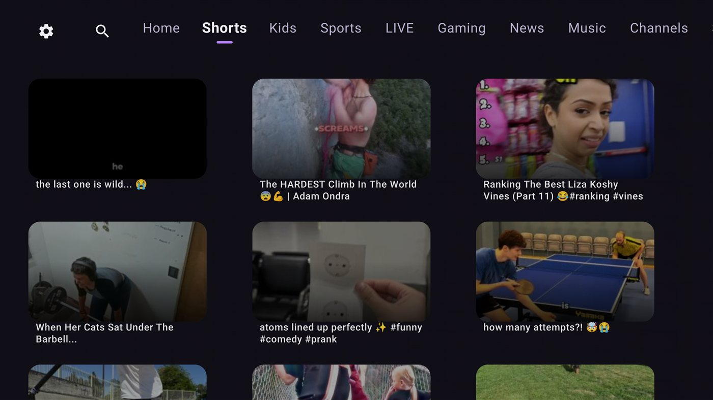
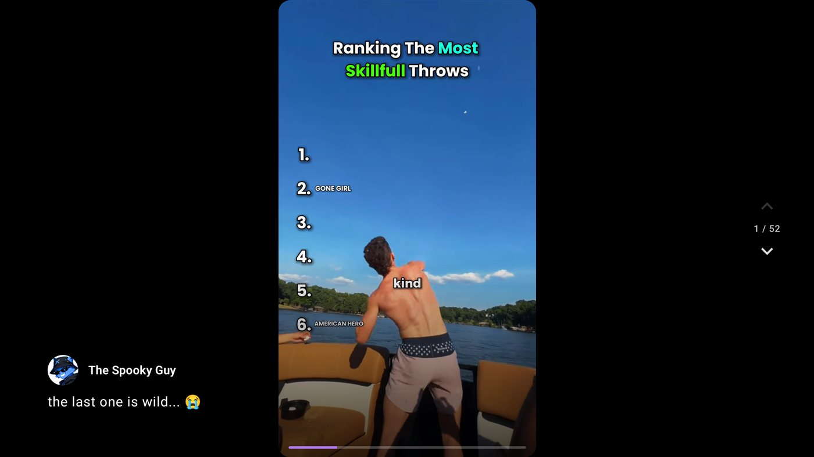

<section class="ah-hero">
  

  
  <h1 class="ah-hero__title">SmartTube, rebuilt for TV.</h1>
  
AetherTube reimagines Android TV YouTube browsing in Jetpack Compose — with a few tricks SmartTube doesn't have.

  

    <a href="guides/installation/" class="md-button md-button--primary">Get started</a>
    <a href="https://github.com/abhimanbhau/AetherTube" class="md-button">View on GitHub</a>
  

  
Scroll

</section>

<section class="ah-panel" id="panel-ambient">
  

    

      

        

          
The flagship feature

          <h2>Built for now, not stretched onto a TV from a decade-old toolkit.</h2>
          
The whole browsing and playback experience, rebuilt from scratch in Jetpack Compose for TV.

        

        

          
Blur, glow, motion

          <h2>A screen that reacts to what you're looking at.</h2>
          
The background carries a softly blurred wash of the focused video's own artwork, and the focus glow picks up its dominant colour — closer to ambient lighting than a grid of boxes.

        

      

    

    

      

      
    

  

</section>

<section class="ah-panel" id="panel-settings">
  

    

      

        

          
Also worth knowing about

          <h2>Forty settings. One code.</h2>
          
Video quality, playback behavior, SponsorBlock, interface tweaks — all of it, collapsed into something you can type with a remote.

        

        

          
Type it on the new device

          
3G41-96RJ-ARGN

        

        

          
No account. No cloud. No internet needed.

          <ul class="ah-list">
            <li>Video quality &amp; playback</li>
            <li>SponsorBlock</li>
            <li>Frame-rate matching</li>
            <li>Interface &amp; overlay</li>
          </ul>
          <a href="guides/transfer-settings/" class="ah-link">See exactly how it works →</a>
        

      

    

    

      
    

  

</section>

<section class="ah-panel" id="panel-shorts">
  

    

      
Shorts that feel like Shorts

      <h2>Flick up. Next video.</h2>
      
A dedicated, full-bleed vertical feed — exactly like the app on your phone. SmartTube opens each Short like a regular video; AetherTube scrolls.

    

    

      
      
    

  

</section>

<section class="ah-closer">
  
Small things too

  <h2>Updates that find you.</h2>
  
AetherTube checks for its own new releases and tells you right in the app, with the actual list of what changed — no remembering to come back and check GitHub for an APK.

</section>

## Where to go next

-   :material-download:{ .lg .middle } **Install AetherTube**

    ---

    Pick a channel, grab the right APK, and sideload it onto your TV.

    [:octicons-arrow-right-24: Installation guide](guides/installation.md)

-   :material-source-branch:{ .lg .middle } **Stable or beta?**

    ---

    Two separate apps, side by side. Here's which one you want.

    [:octicons-arrow-right-24: Stable or beta?](guides/stable-vs-beta.md)

-   :material-key-variant:{ .lg .middle } **Transfer settings**

    ---

    Move your whole setup to a new device with one twelve-character code.

    [:octicons-arrow-right-24: Transfer settings](guides/transfer-settings.md)

-   :material-star-four-points:{ .lg .middle } **What's different**

    ---

    Everything AetherTube changes from stock SmartTube, in one page.

    [:octicons-arrow-right-24: Features](features.md)

!!! info "Not affiliated"
    AetherTube is not affiliated with, endorsed by, or sponsored by YouTube, Google, or
    SmartTube's maintainer — see [Legal](legal.md) for the full disclaimer. It is not on the
    Play Store, F-Droid, or any app store — get builds only from the
    [Releases page](https://github.com/abhimanbhau/AetherTube/releases).
